# Get Started With Casper (First 100 Submissions)


## 1. Create and deploy a simple, smart contract with cargo casper and cargo test


### The screenshot of build and test


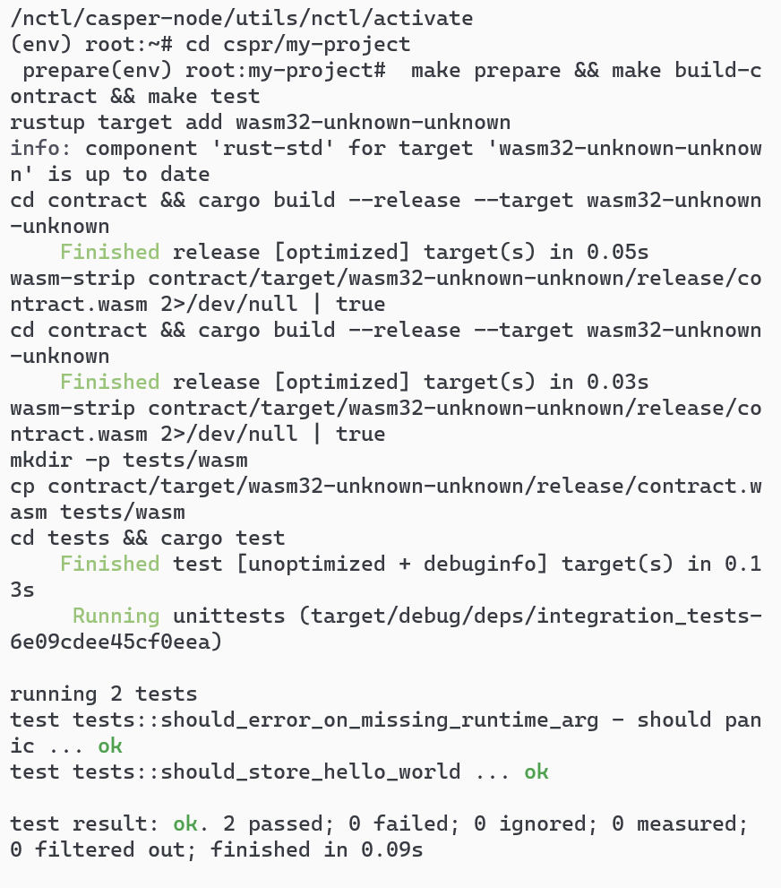


### The screenshot of deploying the contract to testnet and The screenshot of the deployment status:


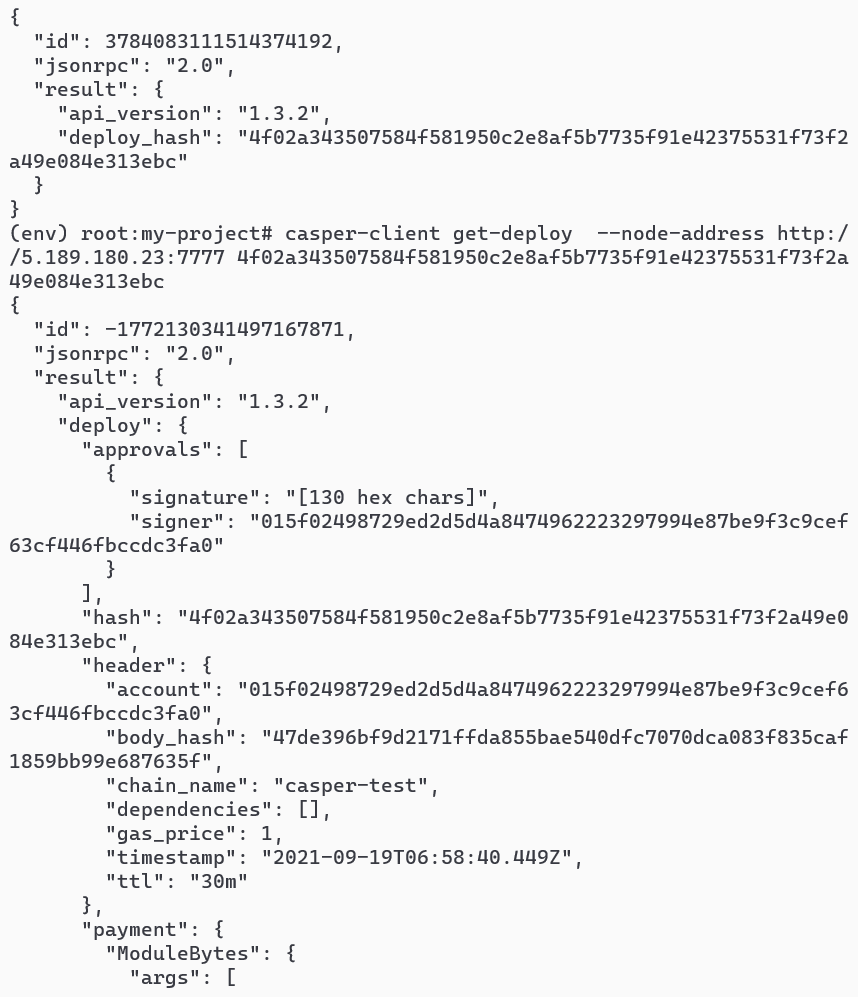


## 2. Complete one of the existing tutorials for writing smart contracts

A Counter Contract Tutorial


Create local network and running node and Check faucet account:
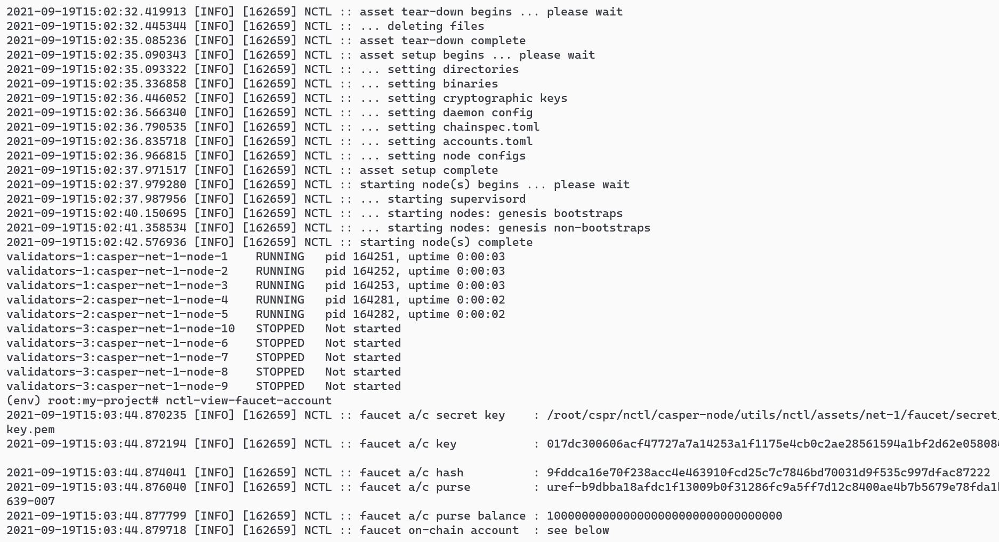

Make prepare and test
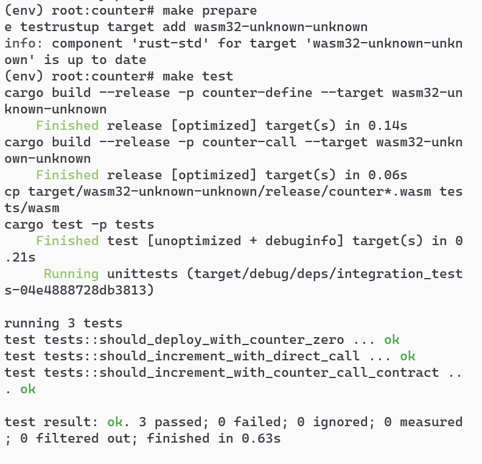

The screenshot of deploying the contract to testnet and The screenshot of the deployment status:
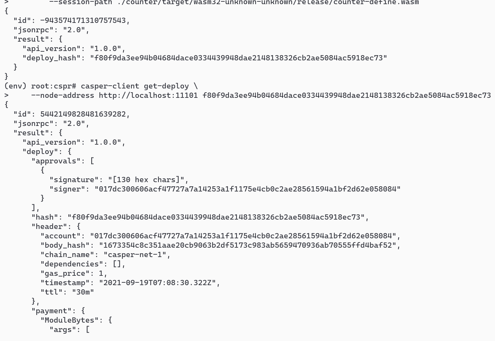

The counter is currently set to 1

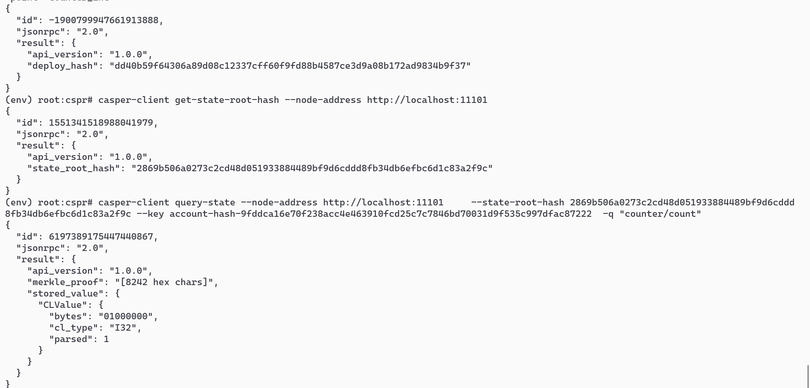

After increment the counter again, the counter is set to 2.

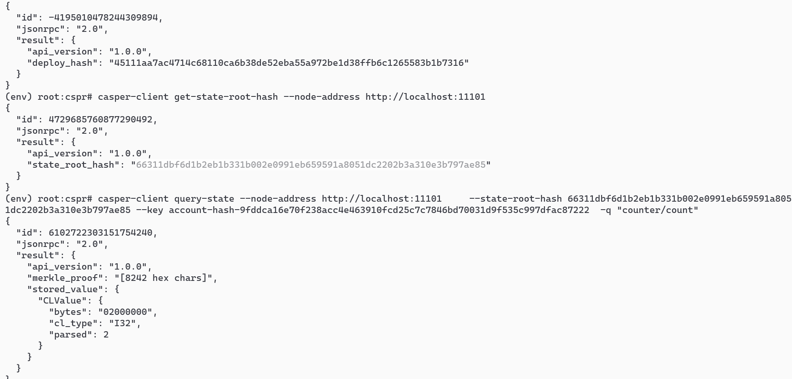

## 3. Demonstrate key management concepts by modifying the client in the Multi-Sig tutorial to address one of the additional scenarios
The 5th.

### change the code
```
const keyManager = require('./key-manager');
const TRANSFER_AMOUNT = process.env.TRANSFER_AMOUNT || 2500000000;
  
(async function () {
    
    // This is the fifth additional scenario.
    // Deployment threshold is set to 2, while key management threshold is set to 3.
    // A set of two keys with weight 1 for each one is created, and
    // a set of three keys with weight 3 (safe keys) are created as well.
    
    // To achive the task, we will:
    // 1. Set mainAccount's weight to 1 (browser key).
    // 2. Add first new key with weight 1 (mobile key).
    // 3. Add second new key with weight 3 (safe key 1).
    // 4. Add third new key with weight 3 (safe key 2).
    // 5. Add fourth new key with weight 3 (safe key 3).
    // 6. Set Keys Management Threshold to 3.
    // 7. Set Deploy Threshold to 2.
    // 8. Make a transfer from mainAccount to recvAccount (new account
    // created) by using the mobile and browser keys together.

    let deploy;

    // 0. Initial state of the account.
    // There should be only one associated key (faucet) with weight 1.
    // Deployment Threshold should be set to 1.
    // Key Management Threshold should be set to 1.
    let masterKey = keyManager.randomMasterKey();
    let mainAccount = masterKey.deriveIndex(1);
    let firstAccount = masterKey.deriveIndex(2);
    let secondAccount = masterKey.deriveIndex(3);
    let thirdAccount = masterKey.deriveIndex(4);
    let fourthAccount = masterKey.deriveIndex(5);
    let recvAccount = masterKey.deriveIndex(6);

    console.log("\n0.1 Fund main account.\n");
    await keyManager.fundAccount(mainAccount);
    await keyManager.printAccount(mainAccount);
    
    console.log("\n[x]0.2 Install Keys Manager contract");
    deploy = keyManager.keys.buildContractInstallDeploy(mainAccount);
    await keyManager.sendDeploy(deploy, [mainAccount]);
    await keyManager.printAccount(mainAccount);

    // 1. Set mainAccount's weight to 1
    console.log("\n1. Set browser key weight to 1\n");
    deploy = keyManager.keys.setKeyWeightDeploy(mainAccount, mainAccount, 1);
    await keyManager.sendDeploy(deploy, [mainAccount]);
    await keyManager.printAccount(mainAccount);
    
    // 2. Add mobile key (weight 1)
    console.log("\n2. Add mobile key (weight 1)\n");
    deploy = keyManager.keys.setKeyWeightDeploy(mainAccount, firstAccount, 1);
    await keyManager.sendDeploy(deploy, [mainAccount]);
    await keyManager.printAccount(mainAccount);
    
    // 3. Add safe key 1 (weight 3)
    console.log("\n3. Add safe key 1 (weight 3)\n");
    deploy = keyManager.keys.setKeyWeightDeploy(mainAccount, secondAccount, 3);
    await keyManager.sendDeploy(deploy, [mainAccount]);
    await keyManager.printAccount(mainAccount);
    
    // 4. Add safe key 2 (weight 3)
    console.log("\n4. Add safe key 2 (weight 3)\n");
    deploy = keyManager.keys.setKeyWeightDeploy(mainAccount, thirdAccount, 3);
    await keyManager.sendDeploy(deploy, [mainAccount]);
    await keyManager.printAccount(mainAccount);
    
    // 5. Add safe key 3 (weight 3)
    console.log("\n5. Add safe key 3 (weight 3)\n");
    deploy = keyManager.keys.setKeyWeightDeploy(mainAccount, fourthAccount, 3);
    await keyManager.sendDeploy(deploy, [mainAccount]);
    await keyManager.printAccount(mainAccount);
        
    // 6. Set Keys Management Threshold to 3.
    console.log("\n6. Set Keys Management Threshold to 3\n");
    deploy = keyManager.keys.setKeyManagementThresholdDeploy(mainAccount, 3);
    await keyManager.sendDeploy(deploy, [mainAccount]);
    await keyManager.printAccount(mainAccount);
    
    // 7. Set Deploy Threshold to 2.
    console.log("\n7. Set Deploy Threshold to 2.\n");
    deploy = keyManager.keys.setDeploymentThresholdDeploy(mainAccount, 2);
    await keyManager.sendDeploy(deploy, [secondAccount]);
    await keyManager.printAccount(mainAccount);
    
    
    // 8. Make a transfer from faucet using the new accounts.
    console.log("\n8. Make a transfer from mainAccount to recvAccount using browser and mobile keys.\n");
    deploy = keyManager.transferDeploy(mainAccount, recvAccount, TRANSFER_AMOUNT);
    await keyManager.sendDeploy(deploy, [mainAccount, firstAccount]);
    await keyManager.printAccount(mainAccount);
    await keyManager.printAccount(recvAccount);
    
})();


```
### edit the json file
`    "start:5": "node -r dotenv/config ./src/scenario-5.js",
`
### Final result:
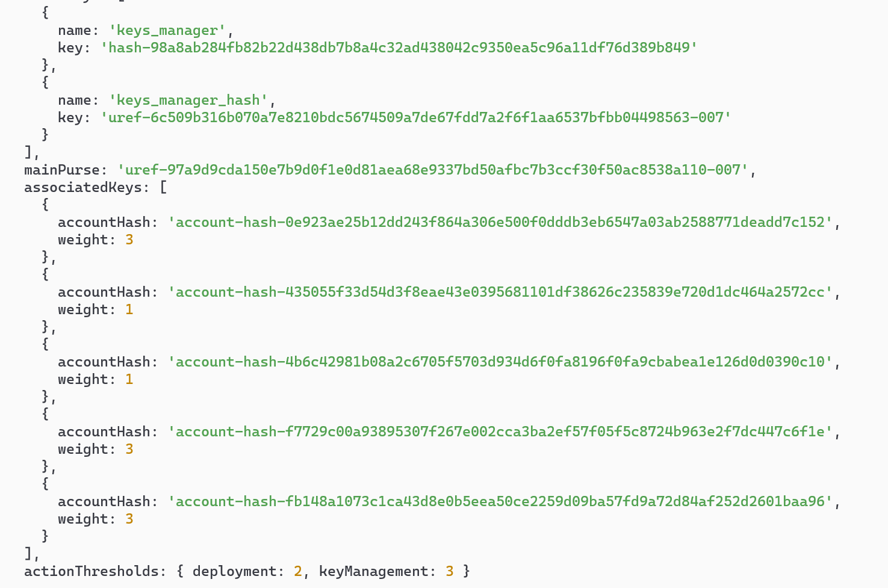

## 4. Learn to transfer tokens to an account on the Casper Testnet. Check out this documentation.
### Screnshot of transfering tokens and deployment status:


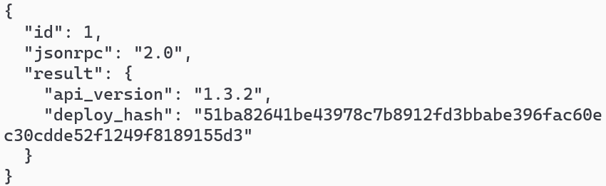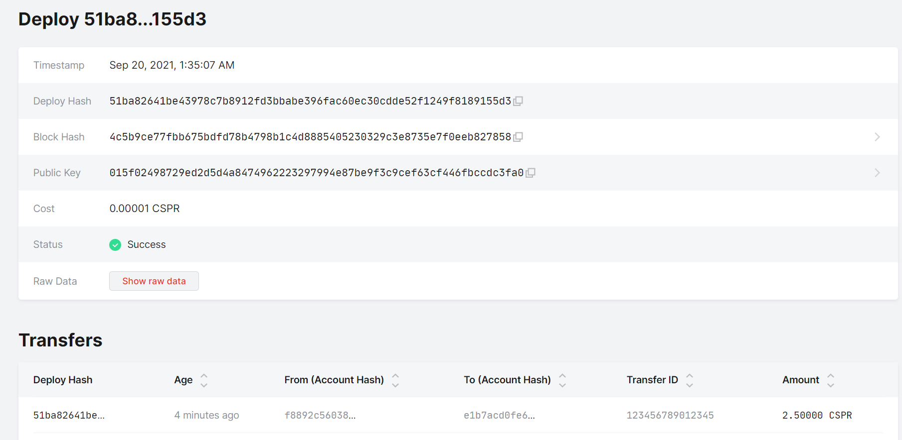


## 5.Learn to Delegate and Undelegate on the Casper Testnet. Check out these instructions.


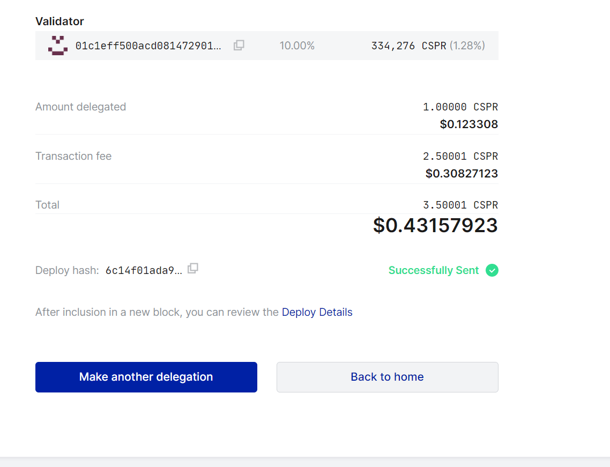


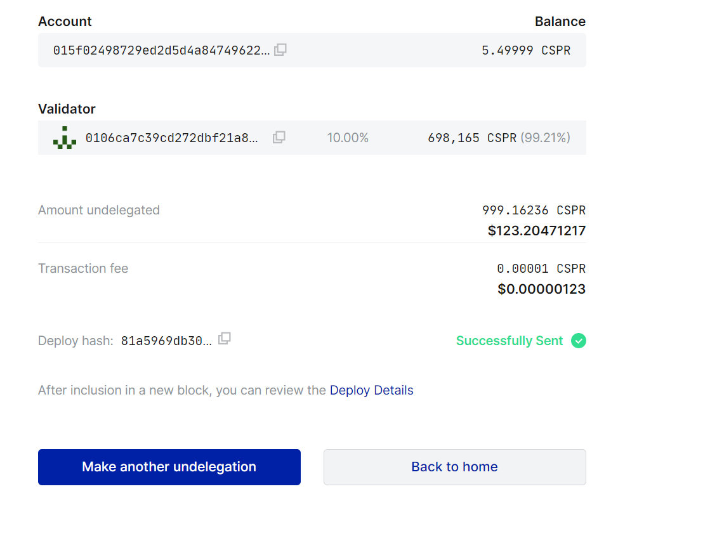
